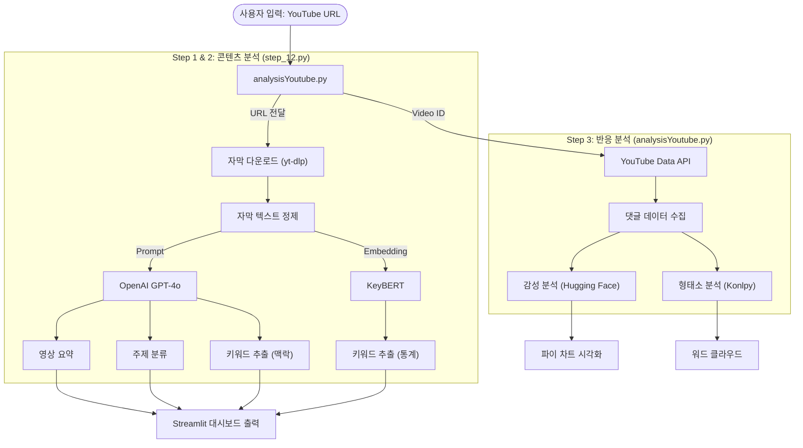

# 🎬 AI 기반 YouTube 콘텐츠 자동 분석 시스템 - 코드 설명서

이 문서는 YouTube 동영상의 내용을 AI로 요약하고, 시청자들의 댓글 반응을 분석하여 시각화하는 프로젝트의 코드 설명서입니다.

## 📂 1. 프로젝트 파일 구조 및 역할

프로젝트는 크게 3생의 핵심 Python 파일로 구성되어 있습니다.

```
📁 teamProject2
├── 📄 download_model.py    # [설정] 감성 분석에 필요한 모델을 미리 다운로드하는 유틸리티
├── 📄 analysisYoutube.py   # [메인] Streamlit 웹 애플리케이션 실행 파일 (UI, 댓글 분석)
└── 📄 step_12.py           # [모듈] 영상 자막 다운로드 및 GPT/BERT 기반 콘텐츠 분석 기능
```

---

## 📝 2. 파일별 상세 코드 설명

### A. download_model.py (초기 설정용)
앱 실행 속도를 높이기 위해 감성 분석 모델을 로컬에 미리 저장하는 스크립트입니다.
- 실행 시 `matthewburke/korean_sentiment` 모델을 다운로드하여 `./my_model` 폴더에 저장합니다.
  - matthewburke/korean_sentiment 모델은 한국어 텍스트의 감정(긍정/부정)을 분석하기 위해 미세 조정(Fine-tuning)된 딥러닝 모델

### B. analysisYoutube.py (메인 애플리케이션)
사용자가 웹 브라우저를 통해 상호작용하는 UI와 댓글 분석의 핵심 로직이 포함되어 있습니다.

- **주요 기능**:
  - **사용자 입력**: YouTube 비디오 ID 또는 URL 입력, API Key 설정.
  - **댓글 수집**: `get_video_comments` 함수를 통해 YouTube Data API v3를 호출하여 댓글 데이터를 가져옵니다.
  - **데이터 전처리**: 정규표현식(Regex)을 사용하여 특수문자, 이모지 등을 제거하고 텍스트를 정제합니다.
  - **감성 분석**: `analyze_comments` 함수에서 Hugging Face의 사전 학습된 한국어 감성 분석 모델을 사용해 긍정/부정을 판단합니다.
  - **시각화**:
    - **파이 차트**: 긍정/부정 비율 표시 (Matplotlib)
    - **워드 클라우드**: 댓글에서 자주 등장하는 명사 키워드 시각화 (WordCloud, Konlpy)

### C. step_12.py (백엔드 분석 모듈)
영상의 '콘텐츠' 자체를 분석하는 기능을 담당하며, `analysisYoutube.py`에서 import하여 사용합니다.

- **주요 기능**:
  - **자막 다운로드 (`download_subtitle`)**: `yt-dlp` 라이브러리를 사용해 영상의 자동 생성된 한국어 자막(.vtt)을 추출합니다.
  - **자막 정제 (`clean_vtt_text`)**: 다운로드된 자막 파일에서 타임스탬프, HTML 태그 등을 제거하여 순수 텍스트로 변환합니다.
  - **AI 요약 및 분석 (`summarize_with_gpt`, `classify_topic_with_gpt`)**:
    - OpenAI의 GPT 모델(gpt-4o)을 사용하여 긴 자막을 5줄 요약하고, 영상의 대분류/소분류 주제를 분류합니다.
  - **키워드 추출**:
    - **GPT**: 문맥을 이해하여 핵심 키워드를 추천합니다.
    - **KeyBERT**: BERT 임베딩 기반의 통계적 방법으로 문서 내 핵심 문구를 추출합니다.


---

## 🛠 3. 사용된 기술 스택

| 구분 | 기술/라이브러리 | 용도 |
| :--- | :--- | :--- |
| **프론트엔드** | `Streamlit` | 웹 인터페이스 구성 및 데이터 시각화 |
| **데이터 수집** | `YouTube Data API` | 댓글 데이터 수집 |
| | `yt-dlp` | 영상 자막(Subtitle) 추출 |
| **AI/ML** | `OpenAI GPT-4o` | 텍스트 요약, 주제 분류, 맥락 기반 키워드 추출 |
| | `Transformers` | 한국어 감성 분석 (BERT 기반 모델) |
| | `KeyBERT` | 통계적 키워드 추출 |
| **NLP** | `Konlpy (Okt)` | 한국어 형태소 분석 (명사 추출) |
| **시각화** | `Matplotlib`, `WordCloud` | 차트 및 워드 클라우드 생성 |

## 🚀 4. 실행 방법

1. **사전 준비**: 
   - `download_model.py`를 먼저 한 번 실행하여 모델을 다운로드합니다.
   ```bash
   python download_model.py
   ```

2. **앱 실행**:
   - 터미널에서 Streamlit 명령어로 분석 앱을 실행합니다.
   ```bash
   streamlit run analysisYoutube.py
   ```

---

## 📊 5. 데이터 처리 파이프라인 (Data Flow)

이 프로젝트의 데이터 흐름을 시각적으로 표현하면 다음과 같습니다.



---

## 💡 6. 핵심 기술 하이라이트

### A. 하이브리드 키워드 추출 전략
단일 알고리즘의 한계를 극복하기 위해 두 가지 방식을 결합했습니다.
- **GPT (맥락 기반)**: "이 영상의 주제가 무엇인가?"라는 문맥적 이해를 바탕으로 키워드를 생성합니다. (예: 영상에 직접 나오지 않아도 관련된 추상적 단어 추출)
- **KeyBERT (통계 기반)**: 텍스트 내에서 실제로 중요하게 등장한 단어의 임베딩 유사도를 분석합니다. (예: 빈도가 높고 핵심적인 구체적 단어 추출)
> **효과**: 두 결과의 교집합과 합집합을 통해 편향되지 않은 풍부한 키워드를 제공합니다.

### B. Streamlit 성능 최적화 (Caching)
반복적인 데이터 처리로 인한 속도 저하와 비용 문제를 해결하기 위해 캐싱 전략을 적용했습니다.

| 적용 대상 | 데코레이터 | 설명 |
| :--- | :--- | :--- |
| **감성 분석 모델** | `@st.cache_resource` | 용량이 큰 딥러닝 모델 로딩 과정을 최초 1회만 수행하고 메모리에 상주시켜 재사용합니다. |
| **API 호출 & 분석** | `@st.cache_data` | 동일한 Video ID에 대한 댓글 수집 및 분석 결과는 저장해두었다가 즉시 반환하여 API 쿼리 비용을 절약합니다. |

### C. 딥러닝 모델 관리 (On-Device Local Loading)
Hugging Face의 모델을 매번 인터넷에서 다운로드하는 오버헤드를 줄이기 위해, `download_model.py` 스크립트를 통해 **로컬 스토리지에 모델을 저장**하고 앱에서는 오프라인 모드로 로드하도록 설계했습니다. 이는 오프라인 환경이나 불안정한 네트워크에서도 안정적인 실행을 보장합니다.
